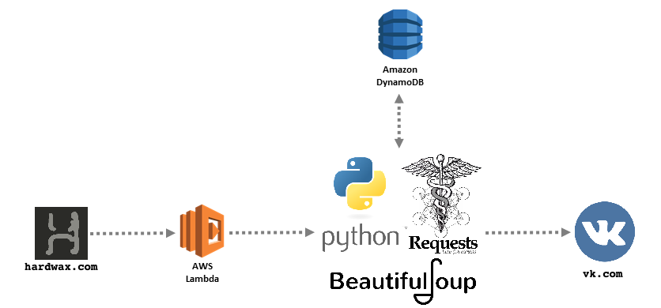
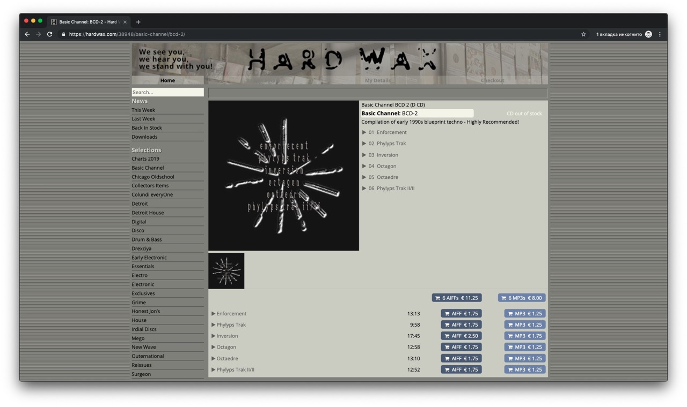
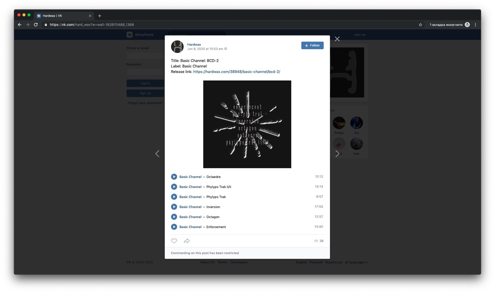
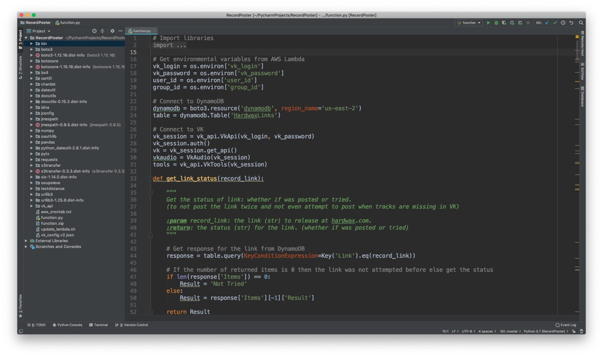

## AWS Lambda function which runs this [community](https://vk.com/hard_wax). 
### 1) Scrapes the web-site of Berlin-based music shop [hardwax.com](https://hardwax.com/).

### 2) Looks up *.mp3s in [VK](https://vk.com/) and posts a music album with full tracks.

### 3) View the actual code [here](function.py). (other files are modules so it will work in AWS Lambda)

